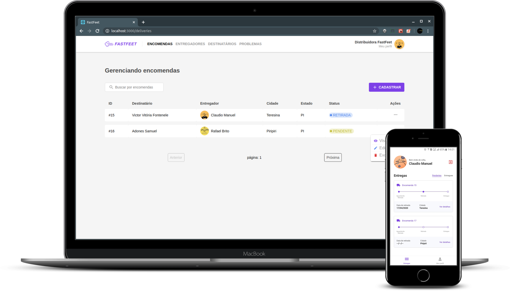

<h1 align="center">
    
</h1>

<h3 align="center">
    
</h3>

<blockquote align="center">“Don't wait to plant, just be patient to harvest!”</blockquote>

<p align="center">
  <a href="#bulb-about">About</a>&nbsp;&nbsp;&nbsp;|&nbsp;&nbsp;&nbsp;
  <a href="#computer-install">Install</a>&nbsp;&nbsp;&nbsp;|&nbsp;&nbsp;&nbsp;
  <a href="#boom-result">Result</a>&nbsp;&nbsp;&nbsp;|&nbsp;&nbsp;&nbsp;
  <a href="#memo-licença">License</a>
</p>

## :warning: Challenge correction:

In mobile development, i used my own cell phone:
- DEVICE -> galaxy j5
- ANDROID_VERSION -> 6.0.1

## :bulb: About

<p>In this project, a complete stack was developed, where we used:</p>

- [Node.js](https://nodejs.org/en/)
- [React](https://reactjs.org/)
- [React Native](https://reactnative.dev/)

<p align="justify">
to build the fastfeet, application where you manage orders, the backend being responsible for all logistics of the application, frontend for company use, thus managing all orders, deliverymen, recipients and problems that may have occurred in delivery and mobile for deliverymen, where they can check available orders, handed out and manage all of them.
</p>

## :computer: Install

**Clone**
```
git clone https://github.com/victorvf/goStack-fastfeet.git
```

**Node.js**

```
- cd backend

- docker-compose build

- docker-compose run node yarn db:migrate

- docker-compose run node yarn db:seed:all

- docker-compose down

- docker-compose up
```

**React**

```
- cd frontend

- yarn install

- yarn start
```

**React Native** -> (I developed this application using my own cell phone(ANDROID), then the access settings are with my machine address, we will have to modify them.)

```
- cd mobile

- config/ReactotronConfig.js -> .configure({ host: 'your host' })
- services/api.js -> baseURL: 'http://yourhost:3333',

- yarn install

- yarn android

- yarn start
```

## :boom: Result

<h3 align="center">
    
</h3>

## :memo: License

this project is under the MIT license. See the archive [LICENSE](https://github.com/Rocketseat/bootcamp-gostack-desafio-03/blob/master/LICENSE.md) for more details.
